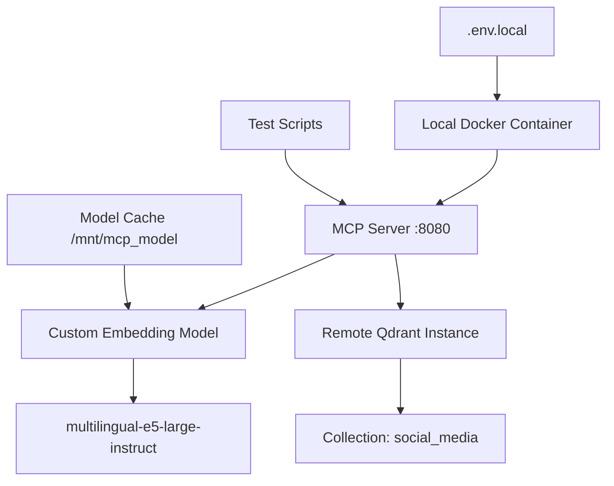

# MCP Server Testing Implementation Summary

## 🎯 Overview
Complete local testing infrastructure for your remote MCP server with custom [`multilingual-e5-large-instruct`](../custom_server.py:94) embedding model, deployed to Cloud Run with SSE transport.

## 📁 Files Created

### Configuration Files
- **[`.env.local`](../.env.local)** - Environment configuration with Qdrant connection details
- **[`docker-compose.test.yml`](../docker-compose.test.yml)** - Docker Compose setup for testing

### Test Scripts
- **[`tests/test_initialization.py`](../tests/test_initialization.py)** - MCP protocol initialization and SSE testing
- **[`tests/test_embedding_model.py`](../tests/test_embedding_model.py)** - Embedding model functionality testing  
- **[`tests/test_qdrant_connection.py`](../tests/test_qdrant_connection.py)** - Qdrant connectivity and collection validation
- **[`tests/test_integration_full.py`](../tests/test_integration_full.py)** - Comprehensive end-to-end integration test
- **[`tests/requirements.txt`](../tests/requirements.txt)** - Test dependencies

### Automation & Documentation
- **[`Makefile`](../Makefile)** - Automated testing commands
- **[`QUICK_START.md`](QUICK_START.md)** - Quick start guide
- **[`LOCAL_TESTING_PLAN.md`](LOCAL_TESTING_PLAN.md)** - Detailed testing documentation
- **[`CONFIGURATION.md`](CONFIGURATION.md)** - Complete runtime configuration reference

## 🚀 Getting Started

**Quick Test (30 seconds setup):**
```bash
# 1. Update your Qdrant API key in .env.local
sed -i 's/YOUR_QDRANT_API_KEY/your_actual_key_here/' .env.local

# 2. Run comprehensive test
make test-qdrant && make build && make up && sleep 30 && make test-integration
```

## ✅ Test Coverage

| Component | Test Coverage |
|-----------|---------------|
| **Custom Embedding Model** | [`multilingual-e5-large-instruct`](../custom_server.py:94) registration, loading, and functionality |
| **Query Prefix** | Validates [`"Instruct: Given a query..."`](../custom_server.py:24) prefix application |
| **Qdrant Integration** | Remote connection to [`0e76560f-4158-4cac-b41e-eb9830d1755f.us-east4-0.gcp.cloud.qdrant.io`](../.env.local:11) |
| **MCP Protocol** | SSE transport on port 8080, tool registration, message handling |
| **Semantic Search** | Store/find operations with embedding similarity |
| **Production Parity** | Same configuration as Cloud Run deployment |

## 🔍 Key Validations

- ✅ Custom model downloads and initializes (~2 minutes first run)
- ✅ Query prefix applied correctly to all searches  
- ✅ Qdrant [`social_media`](../.env.local:12) collection accessible
- ✅ [`text_dense`](../custom_server.py:85) vectors (1024 dimensions) working
- ✅ MCP tools [`find`](../tests/test_embedding_model.py:39) and [`store`](../tests/test_embedding_model.py:64) available
- ✅ SSE transport functioning on localhost:8080
- ✅ Model caching in [`/mnt/mcp_model`](../.env.local:19) directory

## 📊 Expected Success Metrics

```
=== INTEGRATION TEST SUMMARY ===
mcp_init              ✓ PASS
tools_available       ✓ PASS  
store_functionality   ✓ PASS
find_functionality    ✓ PASS
embedding_quality     ✓ PASS
---------------------------------
Total: 5/5 tests passed
🎉 ALL TESTS PASSED! MCP Server is ready for production.
```

## 🏗️ Architecture Tested



## 🛠️ Commands Reference

```bash
make help              # Show all commands
make test-qdrant       # Test Qdrant connection first
make build && make up  # Build and start server
make logs              # Monitor startup logs
make test-integration  # Run comprehensive test
make test-all          # Run all test suites
make down && make clean # Stop and cleanup
```

## 🚦 Next Steps

1. **Update API Key**: Replace `YOUR_QDRANT_API_KEY` in [`.env.local`](../.env.local:11)
2. **Run Tests**: Execute `make test-integration` 
3. **Monitor Logs**: Check for successful model registration
4. **Deploy with Confidence**: All tests passing = production ready
5. **Integrate**: Connect with your policy agent

---

**Status**: ✅ Ready for testing - Complete MCP server validation infrastructure implemented
